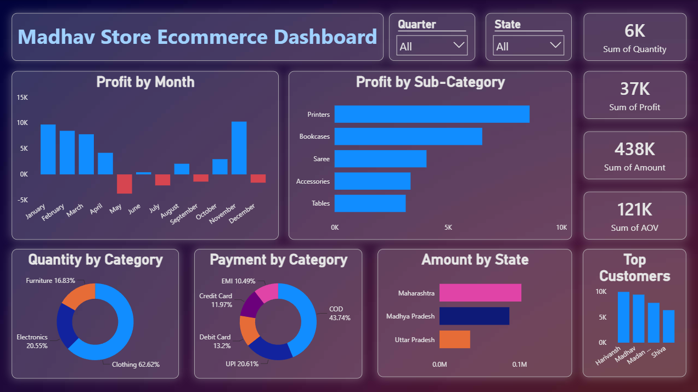

# 📊 Madhav Store Ecommerce Dashboard (Power BI)

## 🖼️ Dashboard Preview

---

## 📌 Project Overview

This project is an interactive **Power BI Ecommerce Dashboard** developed for **Madhav Store** to track and analyze online sales performance across India.

The dashboard transforms raw sales data into meaningful business insights through interactive visualizations, KPIs, filters, and drill-down analysis.

---

## 🎯 Objective

The owner of Madhav Store wanted a dashboard to monitor and analyze online sales across India in order to make better business decisions.

This dashboard helps identify:

- Sales trends
- Profit trends
- Customer purchasing patterns
- Top-performing products
- State-wise sales performance
- Preferred payment methods

---

## 📈 Dashboard Insights

The dashboard provides analysis on:

### 🔹 KPIs

- Total Quantity Sold: **6K**
- Total Profit: **37K**
- Total Sales Amount: **438K**
- Average Order Value (AOV): **121K**

### 🔹 Visual Analysis

- Profit by Month
- Profit by Sub-Category
- Quantity by Category
- Payment Method Distribution
- Amount by State
- Top Customers

### 🔹 Interactive Filters

- Quarter Filter
- State Filter

---

## 🛠️ Tools & Technologies Used

- Power BI
- Power Query
- DAX (Data Analysis Expressions)
- Data Modeling
- CSV Dataset
- Data Visualization

---

## 📂 Dataset

The project uses two datasets:

### Orders.csv

Contains information such as:

- Order ID
- Order Date
- Customer Name
- State
- Category
- Payment Mode

### Details.csv

Contains information such as:

- Order ID
- Product Details
- Quantity
- Amount
- Profit

---

## ⚙️ Project Workflow

1. Imported CSV datasets into Power BI.
2. Cleaned and transformed the data.
3. Created relationships between tables.
4. Built DAX calculations and KPIs.
5. Added interactive slicers and filters.
6. Designed visualizations.
7. Generated business insights.

---

## 📚 Key Learnings

- Created an interactive business dashboard.
- Performed data cleaning and transformation.
- Built relationships between multiple datasets.
- Used DAX measures for calculations.
- Implemented slicers and drill-down analysis.
- Improved data visualization and storytelling skills.

---

## 🚀 Future Improvements

- Year-over-year comparison
- Sales forecasting
- Customer segmentation
- Advanced KPIs
- Automated data refresh

---

## 👨‍💻 Author

Animesh Halder
